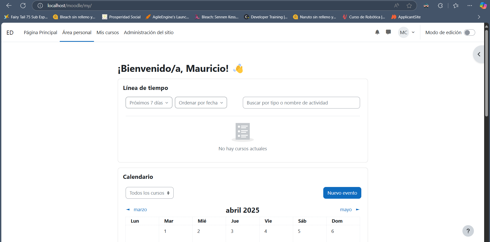

# Prueba Técnica para Desarrollador Full Stack en Escuela Didáctica

La descripción de la prueba técnica se encuentra en el archivo [Descripción Prueba Técnica](./escuela_didactica/technical_assessment.pdf).

## Para ejecutar la app

Sigue estos pasos para ejecutar la aplicación correctamente.

1. Crea la base de datos **MySQL** *todoapi*

2. Copia el archivo `.env.example` a `.env` y reemplaza los valores de *DB_*

3. Crea una key para la aplicación
> php artisan key:generate

4. Ejecuta las migraciones para la creación de tablas
> php artisan migrate

5. Ejecuta el servidor backend **(API)**
> php artisan serve

6. Ejecuta el servidor frontend **(React App)**
> npm run dev

## Respuestas a las preguntas de la prueba

### 1. ¿Cómo mejorar el rendimiento de la API?

Para esto se pueden seguir varias opciones como:

- Caching: Es posible utilizar un servicio de caching como Redis para guardar el resultado de algunas peticiones ya realizadas que requiren de mucho tiempo de ejecución y consumen muchos recursos del servidor. Esto mejora la respuesta de la API para que sea más rápida así como la optimización de recursos.

- Utilizando índices: En las tablas es posible crear índices que permiten realizar operaciones en la base de datos con mayor rápidez, gracias a que la búsqueda de los elementos será mucho más rápida al apuntar directamente al registro correspondiente.

- Paginación: Reestructurar los endpoints que retornan posibles amplias listas de datos para que paginen la data, es decir, retornen únicamente un número determinado de registros (definido en la API o por el cliente), y que permita retornar diferentes páginas según a lo que solicite el cliente.

- Concurrencia: Para mejorar la velocidad de respuesta a múltiples usuarios y requests se puede implementar concurrencia por medio de diversas técnicas como la utilización de estructuras de colas.

- Arquitectura: Es posible seleccionar una arquitectura distinta según a los requerimientos del cliente, del sistema, y del equipo. Se puede elegir alguna arquitectura que permita una fácil escalabilidad ya sea horizontal o vertical (microservicios, kubernetes, etc.).

### 3. Consulta SQL optimizada

````
SELECT * from tasks
WHERE completed = 0
AND user_id = "user_id"
ORDER BY created_at DESC
````

*¿Qué es un índice compuesto y cómo puede beneficiar la consulta anterior?*

Un índice compuesto es aquel que se conforma por más varias columnas seleccionadas de la alguna tabla. Si nuestra tabla de tasks es demasiado larga al tener un índice compuesto que tenga en cuenta a `user_id` y alguna otra columna como `completed` o `created_at` es posible obtener un resultado mucho más rápido ya que el motor de la base de datos encontrará el registro con una mayor facilidad y rápidez.

### ¿Qué es TensorFlow.js y algún caso de uso potencial para aplicaciones web?

TensorFlow.js es una librería de JavaScript creada por Google que permite entrenar y ejecutar modelos de machine learning o inteligencia artificial  en el navegador, es decir, es posible tener capacidades de inteligencia artifical desde el frontend.

En cuanto a los casos de uso potenciales, realmente son muchos y varian según a las necesidades de loc clientes, objetivos del negocio, y modelo de negocio de la aplicación. Por mencionar algunas opciones podríamos encontrarnos con:
- Clasificación automática de tareas según la descripción.
- Completado de formularios de forma automática (de ventas, de leads, de gestión del riesgo, etc.).
- Análisis de documentos para brindar información al cliente.
- Creación de resumen en audio como función de accesibilidad.
- Transformación de texto a lenguaje de señas como función de accesibilidad.

### 7. Moodle y Error en Plugin Estado de Finalización

- Instalación de Moodle 4.5

    - Descargar Moodle desde este [link](https://download.moodle.org/download.php/direct/stable405/moodle-latest-405.zip)

    - Descomprimir el archivo descargado en el servidor de XAMPP (Si no se tenía XAMPP previamente instalado, se debe descargar su instalador y ejecutarlos)
    
    

    - Crear base de datos usando phpMyAdmin (para esto se debe iniciar el servidor de XAMPP, iniciar Apache, MySQL, y luego acceder como admin a MySQL)
    
    

    - Actualizar el archivo `config-dist.php` con los valores de conexión a la base de datos (el archivo esta dentro de la carpeta `moodle` descomprimida en la carpeta `xampp`)
    

    - Copiar la carpeta `moodle` y ponerla dentro de la carpeta `htdocs`
    

    - Ingrasar a `moodle` en la dirección `localhost/moodle`, y seguir los pasos d einstalación
    

        - Si sale algún error como requerir alguna extensión de PHP se debe detener el servidor de Apache, abrir el archivo de ocnfiguración `php.ini` (desde XAMPP, dando click en `config` de Apache) y descomentar la línea correspondiente de la extensión requerida (quitar punto y coma)
        

        - Si la versión de XAMPP utilizada no cuenta con la versión adecuada de MySQL (MariaDB) es necesario instalar una nueva versión de MariaDB por aparte. Para esto se ha de descargar la versión correspondiente, hacer que se ejecute en un puerto distinto, detener la versión de MySQL de XAMPP, actualizar los datos de conexión en config.php, reiniciar y recargar el proceso de instalación de Moodle.

    - Instalación de Moodel completada
    

- Instalación de Plugin `completion_progress`

    - Se debe descargar y descomprimir el plugin tipo bloque

    - Luego se debe ubicar la carpeta descomprimida dentro de la carpeta `blocks` que esta en `xampp/htdocs/`
    

    - Al volver a iniciar Moodle se detectará el nuevo plugin y se mostrará el botón para actualizar la base de datos
    

- Restaurar curso demo

    - Para esto simplemente se debe ir a administración del sitió > cursos > restaurar curso. Y luego seguir los pasos correspondientes
    
